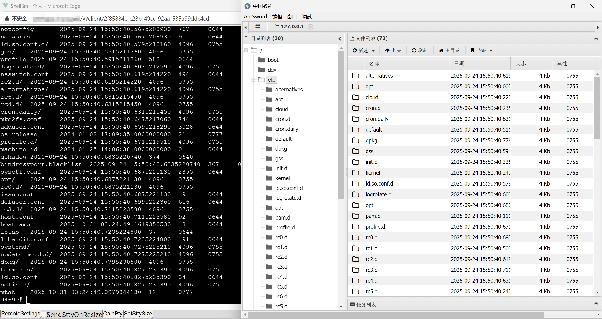
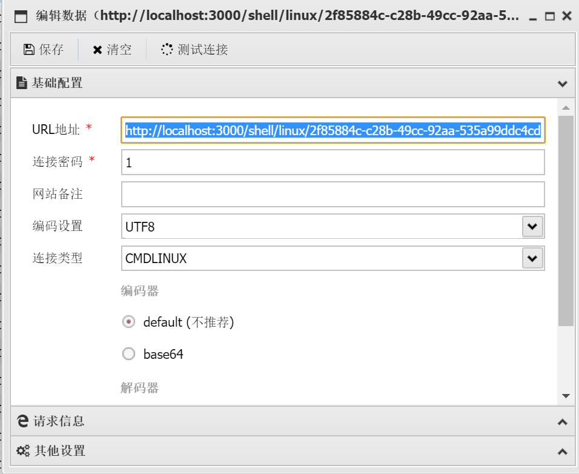

# REVSHELL2WEBSHELL

an interesting experiment to convert reverse shell into antsword "web"shell.

designed to use with [ShellBin](https://github.com/CwithW/ShellBin) and [AntSword](https://github.com/AntSwordProject/antSword).





## Compiling

first, change the SHELLBIN_ADDR in app.ts to your ShellBin deployment addr.

```
npm install
# you should have typescript installed your global environment, if not, run `npm install -g typescript`
tsc
```


## Usage

```
node app.js
```

have a reverse shell in ShellBin. copy its uuid. (`http://shellbin.example.com/#/client/2f85884c-c28b-49cc-92aa-535a99ddc4cd` -> uuid=`2f85884c-c28b-49cc-92aa-535a99ddc4cd`)

in AntSword, create a shell `http://localhost:3000/shell/<OS>/<UUID>`, os can be linux/windows.

use Connection Type 连接类型 CMDLINUX/PSWINDOWS.

use Default encoders and decoders 编码器/解码器, or needle detection will error.




